<div align="center">

# 🛠️ Multi-Utility Toolkit
### *Interactive Python Console Application Combining Date-Time, Math, Random, File Handling, UUID and Module Utilities*


</div>

---

# 📋 Table of Contents

- [📌 Overview](#-overview)
- [🎯 Problem Statement](#-problem-statement)
- [✨ Key Features](#-key-features)
- [🏗️ Project Structure](#-project-structure)
- [🔄 Project Workflow](#-project-workflow)
- [🕒 Date-Time Operations](#-date-time-operations)
- [🧮 Mathematical Operations](#-mathematical-operations)
- [🎲 Random Data Generation](#-random-data-generation)
- [🆔 UUID Generator](#-uuid-generator)
- [📂 File Operations](#-file-operations)
- [📜 Module Attributes Explorer](#-module-attributes-explorer)
- [🚫 Error Handling](#-error-handling)
- [🛠️ Tech Stack](#-tech-stack)
- [📈 Results & Insights](#-results--insights)
- [🏆 Advantages](#-advantages)

---

# 📌 Overview

The **Multi-Utility Toolkit** is a modular Python console application that combines multiple useful utilities into one project.

This project demonstrates:

- Python Modules
- Custom Modules
- File Handling
- Date & Time Operations
- Mathematical Calculations
- Random Data Generation
- UUID Generation
- Module Exploration using `dir()`
- Match Case Statements
- Exception Handling

---

# 🎯 Problem Statement

Build a Python-based toolkit that combines multiple utility features into one menu-driven application.

The program should:

- Perform date and time operations
- Solve mathematical calculations
- Generate random data
- Create UUIDs
- Perform file operations
- Explore module attributes

---

# ✨ Key Features

| Feature | Description |
|---------|-------------|
| 🕒 Date-Time | Current time, stopwatch, countdown |
| 🧮 Math Operations | Factorial, compound interest, trigonometry |
| 🎲 Random Tools | Random numbers, lists, passwords, OTP |
| 🆔 UUID Generator | Generate unique IDs |
| 📂 File Operations | Create, write, read, append files |
| 📜 dir() Explorer | Display available module functions |
| 🔁 Menu Driven | Continuous running toolkit |
| ⚠️ Error Handling | Handles invalid input safely |

---

# 🏗️ Project Structure

```text
📦 Project 7/
│
├── 📄 toolkit.py
├── 📄 date_time.py
├── 📄 mathemetic.py
├── 📄 random_num.py
├── 📄 file_op.py
├── 📄 uuid_gene.py
├── 📄 dir_modul.py
├── 📄 abc.txt
└── 📄 README.md
```

---

# 🔄 Project Workflow

```text
Program Start
      │
      ▼
Display Main Menu
      │
      ├── 1 ➜ Date-Time Operations
      ├── 2 ➜ Mathematical Operations
      ├── 3 ➜ Random Data Generation
      ├── 4 ➜ UUID Generator
      ├── 5 ➜ File Operations
      ├── 6 ➜ Module Attributes Explorer
      └── 0 ➜ Exit
```

---

# 🕒 Date-Time Operations

Includes:

- Current Date and Time
- Date Difference
- Date Formatting
- Stopwatch
- Countdown Timer

### Output

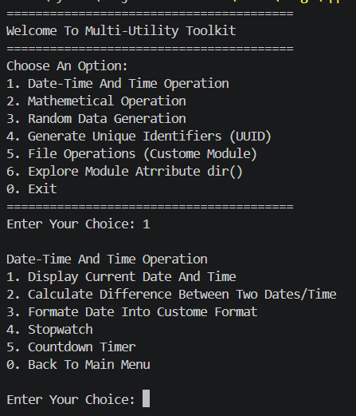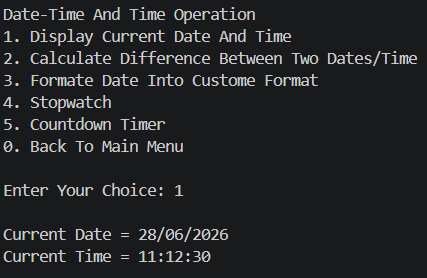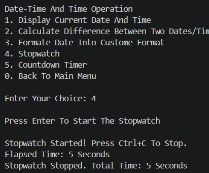

---

# 🧮 Mathematical Operations

Includes:

- Factorial Calculation
- Compound Interest
- Trigonometric Functions
- Area Calculation

Uses Python `math` module.

### Output

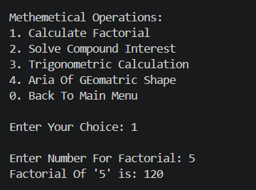
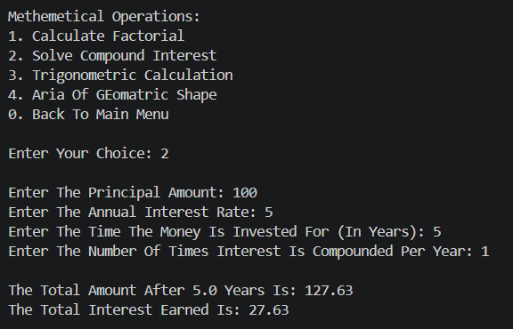

---

# 🎲 Random Data Generation

Includes:

- Random Integer Generator
- Random List Generator
- Random Password Generator
- OTP Generator

Uses Python `random` module.

### Output

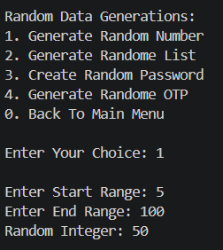
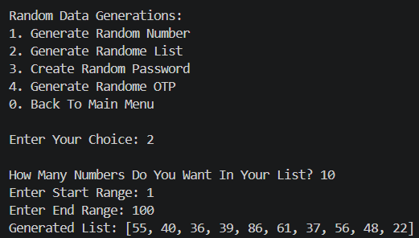

---

# 🆔 UUID Generator

Generates unique identifiers using Python `uuid` module.

Useful for:

- Unique IDs
- Tokens
- Session IDs

### Output

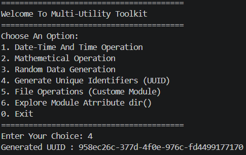

---

# 📂 File Operations

Custom module for:

- Create File
- Write File
- Read File
- Append File

Uses file handling concepts.

### Output


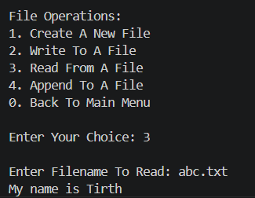

---

# 📜 Module Attributes Explorer

Uses `dir()` function to display available functions inside custom modules.

Helps understand module structure.

### Output

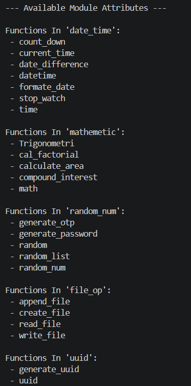

---

# 🚫 Error Handling

The project handles:

- Invalid menu choices
- Invalid integer input
- File not found errors

### Output

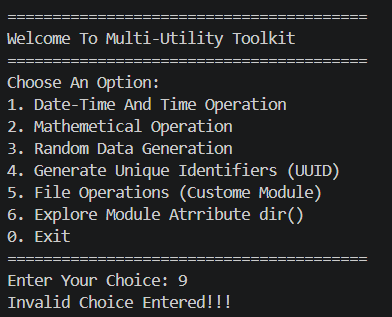
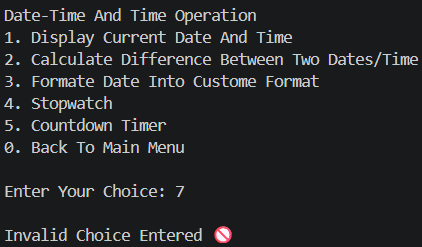

---

# 🛠️ Tech Stack

| Technology | Purpose |
|------------|---------|
| 🐍 Python | Core Programming Language |
| 📦 Modules | Code organization |
| 📂 File Handling | File management |
| 🕒 Datetime | Time operations |
| 🧮 Math Module | Calculations |
| 🎲 Random Module | Random data |
| 🆔 UUID Module | Unique IDs |
| 📜 dir() | Module inspection |
| 🚫 Exception Handling | Error management |
| 🔁 Loops | Menu repetition |
| 🎛️ Match Case | Menu handling |
| 🖥️ Console I/O | User interaction |

---

# 📈 Results & Insights

After executing the program:

- ✅ Multiple utilities work in one toolkit
- ✅ Custom modules improve code structure
- ✅ Mathematical functions work efficiently
- ✅ Random generators produce useful data
- ✅ File operations are managed successfully
- ✅ UUIDs are generated uniquely
- ✅ dir() helps inspect modules

---

# 🏆 Advantages

| Advantage | Description |
|-----------|-------------|
| 🎓 Beginner Friendly | Covers many Python concepts |
| 📚 Educational | Strong module practice |
| ⚡ Fast | Multiple tools in one app |
| 🧠 Practical | Useful real-world toolkit |
| 🔄 Modular | Easy to expand |
| 🖥️ Lightweight | Runs in terminal |

---

# 👤 Author
<div align="center">

**Tirth Donga**

🎓 Python Multi-Module Project

</div>

---

### ⭐ Thank You For Visiting This Project ⭐

Made with ❤️ using Python
