<div align="center">

# 🎓 Student Data Organizer
### *Interactive Python Console Application for Managing Student Records*


> *"Organizing student records efficiently using Python data structures and menu-driven programming."*

</div>

---

# 📋 Table of Contents

- [📌 Overview](#-overview)
- [🎯 Problem Statement](#-problem-statement)
- [✨ Key Features](#-key-features)
- [🏗️ Project Structure](#️-project-structure)
- [🔄 Project Workflow](#-project-workflow)
- [1. ➕ Add Students](#-add-students)
- [2. 📄 Display All Students](#-display-all-students)
- [3. 🔍 Search Student Record](#-search-student-record)
- [4. ✏️ Update Student Information](#️-update-student-information)
- [5. 🗑️ Delete Student Record](#️-delete-student-record)
- [6. 🧹 Clear All Data](#-clear-all-data)
- [7. 📚 Display Subjects Offered](#-display-subjects-offered)
- [🚫 Error Handling](#-error-handling)
- [🛠️ Tech Stack](#️-tech-stack)
- [📈 Results & Insights](#-results--insights)
- [🏆 Advantages](#-advantages)
- [📄 License](#-license)
- [👤 Author](#-author)

---

# 📌 Overview

The **Student Data Organizer** is a beginner-friendly Python console application designed to manage student records using core Python programming concepts.  

This project demonstrates:
- Menu-driven programming
- Python data structures
- Conditional statements
- Loops and iteration
- CRUD operations
- User input handling

The application allows users to:
- Add student records
- Display all student information
- Search students by ID
- Update student details
- Delete student records
- Clear all stored data
- Display all unique subjects

---

# 🎯 Problem Statement

> Build a Python-based console application that helps organize and manage student records efficiently.

The program should:
- Store student information dynamically
- Allow modification and deletion of records
- Provide quick searching functionality
- Maintain a list of all offered subjects
- Use Python collections such as Lists, Dictionaries, and Sets

---

# ✨ Key Features

| Feature | Description |
|---------|-------------|
| ➕ Add Students | Add student details into the system |
| 📄 Display All Students | View all stored student records |
| 🔍 Search Student | Find student using Student ID |
| ✏️ Update Information | Modify name, age, grade, or subjects |
| 🗑️ Delete Student | Remove a student record |
| 🧹 Clear All Data | Delete all stored records |
| 📚 Subject Management | Display all unique subjects |
| 🔁 Infinite Menu Loop | Program runs continuously until exit |
| 🖥️ Console Interface | Clean menu-driven CLI application |
| ⚠️ Invalid Input Handling | Displays error messages for wrong choices |

---

# 🏗️ Project Structure

```text
📦 Project 3/
│
├── 📁 Images              ← All Output Iamges
│
├── 📄 student_menu.py     ← Main Python Program
│
└── 📄 README.md           ← Project Documentation
```

---

# 🔄 Project Workflow

```text
Program Start
      │
      ▼
Display Main Menu
      │
      ├── 1 ➜ Add Student
      ├── 2 ➜ Display All Students
      ├── 3 ➜ Search Student
      ├── 4 ➜ Update Student
      │           ├── 1. Name
      │           ├── 2. Age
      │           ├── 3. Grade
      │           └── 4. Subjects
      ├── 5 ➜ Delete Student
      ├── 6 ➜ Clear All Data
      ├── 7 ➜ Display Subjects
      └── 0 ➜ Exit
```

---

# ➕ Add Students

This feature allows users to insert new student records into the system.

### 📥 User Inputs
- Student GRID/ID
- Name
- Age
- Grade
- Date of Birth
- Subjects

### 🧠 Concepts Used
- Dictionary
- List
- Set
- Tuple
- String Split
- Loops

### 💻 Output

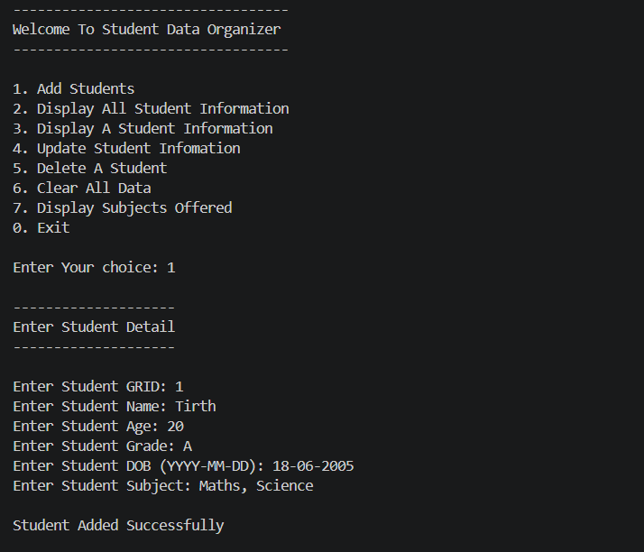

---

# 📄 Display All Students

Displays every stored student record in a formatted output.

### 🧠 Logic Used
- Iteration using `for` loop
- Dictionary value access
- String formatting

### 💻 Output

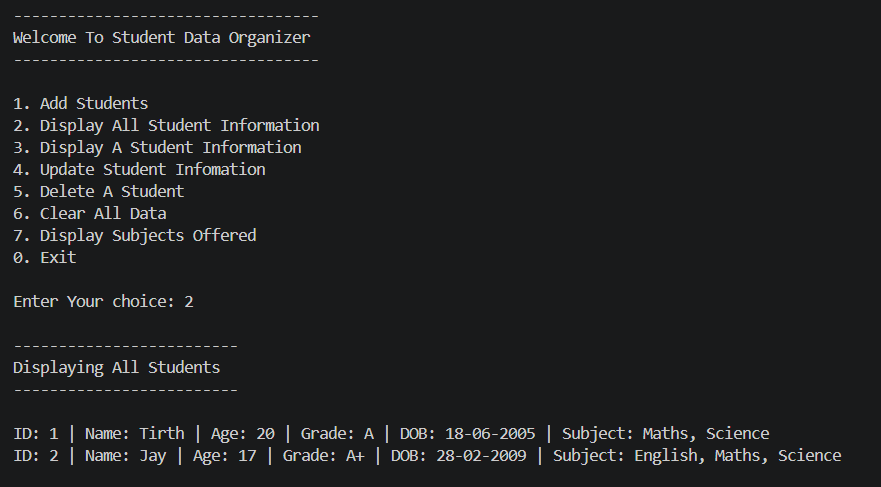

---

# 🔍 Search Student Record

Searches for a student using their unique Student ID.

### 🧠 Concepts Used
- Dictionary lookup
- Conditional statements

### 💻 Output

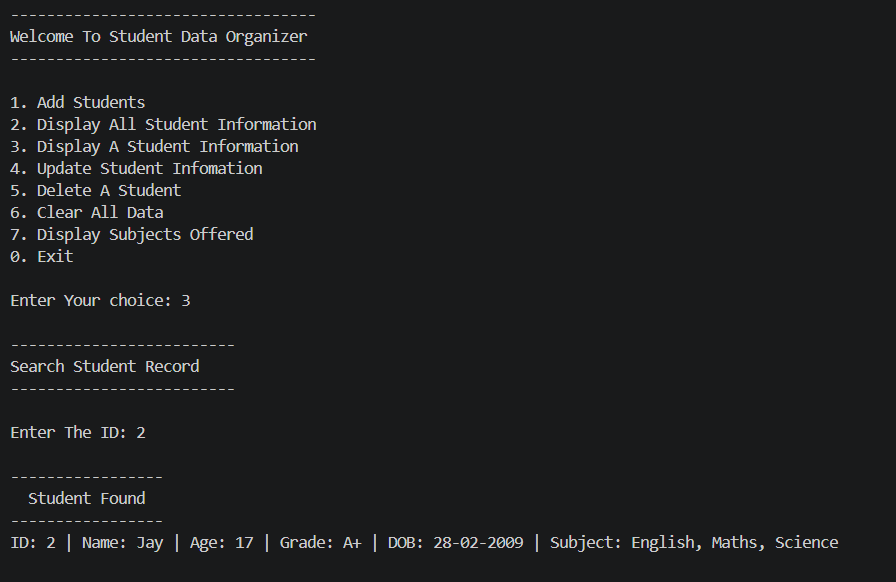

---

# ✏️ Update Student Information

Allows modification of:
- Name
- Age
- Grade
- Subjects

### 🧠 Concepts Used
- Nested Menu
- Match Case
- Dictionary Update

### 💻 Output

```
Before Update
```
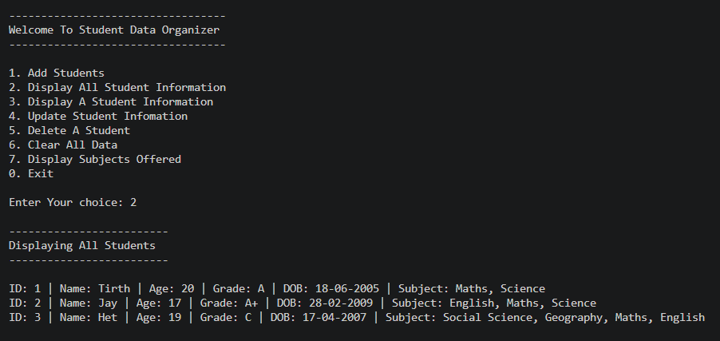

```
Updating
```
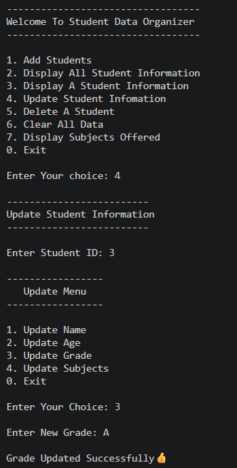

```
After Update
```
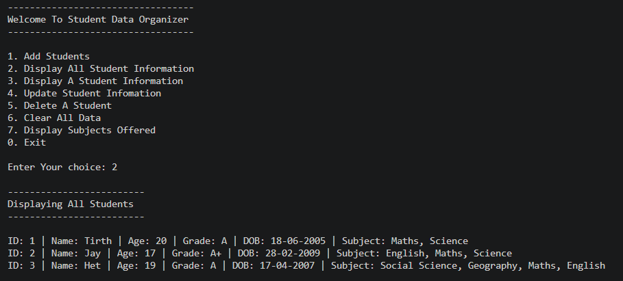

---

# 🗑️ Delete Student Record

Deletes a student record from:
- List
- Dictionary

### 🧠 Concepts Used
- Looping
- Record removal
- Conditional checking

### 💻 Output
```
Before Deleting
```


```
Deleting Student
```
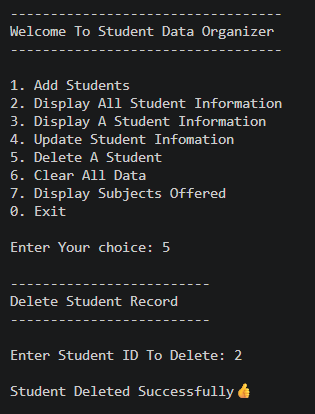


```
After Deleting
```
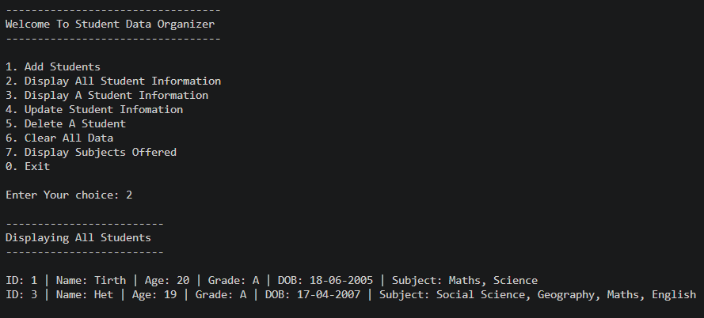

---

# 🧹 Clear All Data

Completely wipes:
- Student List
- Student Dictionary
- Subject Set

### 💻 Output
```
Before Cleared
```


```
Clearing Data
```
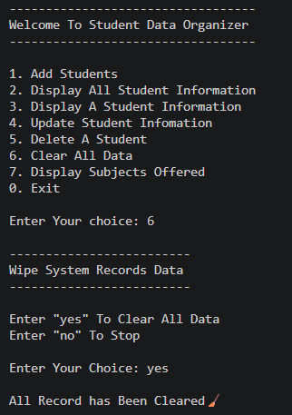

```
After Cleared
```
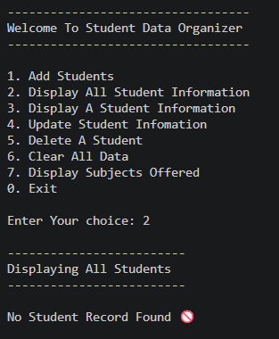

---

# 📚 Display Subjects Offered

Displays all unique subjects available in the system.

### 🧠 Concepts Used
- Python Set
- String Join

### 💻 Output

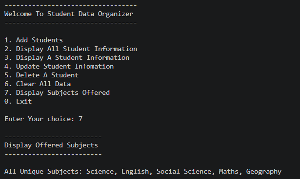

---

# 🚫 Error Handling!!

The program includes basic error handling to improve user experience and prevent unexpected behavior during execution.

## ✅ Error Handling Features

- Detects invalid menu choices entered by the user
- Displays warning messages for incorrect options
- Prevents crashes by checking whether student records exist before updating or  deleting
- Handles empty record situations while displaying student data
- Confirms before clearing all stored data

### 💻 Output:

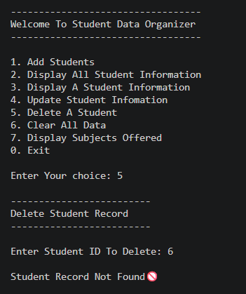 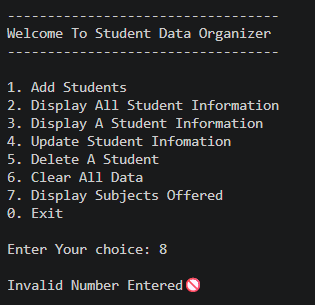 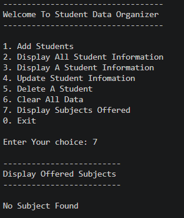

---
# 🛠️ Tech Stack

| Technology | Purpose |
|------------|---------|
| 🐍 Python | Core Programming Language |
| 📚 List | Store student records |
| 🛟 Tuple | Store ID and DOB Of Students (Immutable) |
| 📖 Dictionary | Fast student lookup |
| 🧩 Set | Store unique subjects |
| 🔁 Loops | Menu repetition and iteration |
| ⚙️ Match Case | Menu option handling |
| 🖥️ Console I/O | User interaction |

---

# 📈 Results & Insights

After executing the program:

- ✅ Student records can be added dynamically
- ✅ Data can be searched instantly using Student ID
- ✅ Records can be updated and deleted
- ✅ Unique subjects are tracked automatically
- ✅ Program continuously runs until user exits
- ✅ Multiple Python data structures are implemented effectively

---

# 🏆 Advantages

| Advantage | Description |
|-----------|-------------|
| 🎓 Beginner Friendly | Great project for Python beginners |
| 📚 Practical CRUD System | Real-world record management logic |
| ⚡ Fast Searching | Dictionary provides quick lookup |
| 🧠 Data Structure Practice | Uses List, Dictionary, and Set |
| 🔄 Extendable | Can easily add file/database support |
| 🖥️ Lightweight | Runs directly in terminal |
| 🛠️ Easy to Understand | Clean menu-based logic |

---

# 📄 License

This project is licensed under the **MIT License**.

```text
MIT License — Free to use, modify, and distribute.
```

---

# 👤 Author

<div align="center">

#  Tirth Donga

[](https://github.com/tirthdonga)
🎓 Beginner Python Program

</div>

---

<div align="center">

### ⭐ Thank You For Visiting This Project ⭐

Made with ❤️ using Python

</div>
