<div align="center">

# 👨‍💼 Employee Management System
### *Interactive Python Console Application for Managing Person, Employee, Manager and Developer Records*


</div>

---

# 📋 Table of Contents

- [📌 Overview](#-overview)
- [🎯 Problem Statement](#-problem-statement)
- [✨ Key Features](#-key-features)
- [🏗️ Project Structure](#-project-structure)
- [🔄 Project Workflow](#-project-workflow)
- [👤 Create Person](#-create-person)
- [💼 Create Employee](#-create-employee)
- [🧑‍💼 Create Manager](#-create-manager)
- [👨‍💻 Create Developer](#-create-developer)
- [📄 Display All Records](#-display-all-records)
- [🔍 Check Subclass](#-check-subclass)
- [🚫 Error Handling](#-error-handling)
- [🛠️ Tech Stack](#-tech-stack)
- [📈 Results & Insights](#-results--insights)
- [🏆 Advantages](#-advantages)

---

# 📌 Overview

The **Employee Management System** is a menu-driven Python project built using Object-Oriented Programming concepts. It manages records of Person, Employee, Manager, and Developer with inheritance and encapsulation.

---

# 🎯 Problem Statement

Build a Python-based employee management system using classes and inheritance.

The program should:

- Store person records
- Store employee records
- Store manager records
- Store developer records
- Display all stored data
- Check inheritance relationships
- Handle invalid menu choices

---

# ✨ Key Features

| Feature | Description |
|---------|-------------|
| 👤 Person Creation | Create basic person records |
| 💼 Employee Creation | Create employee records |
| 🧑‍💼 Manager Creation | Create manager with department |
| 👨‍💻 Developer Creation | Create developer with language |
| 📄 Display Records | Show stored object data |
| 🔍 Subclass Check | Verify inheritance relationship |
| 🔒 Encapsulation | Protect salary and ID |
| 🔁 Menu Driven | Continuous loop system |

---

# 🏗️ Project Structure

```text
📦 Project 5/
│
├── 📄 employee.py
│
├── 📄 README.md
│
└── 📁 images
```

---

# 🔄 Project Workflow

```text
Program Start
      │
      ▼
Display Main Menu
      │
      ├── 1 ➜ Create Person
      ├── 2 ➜ Create Employee
      ├── 3 ➜ Create Manager
      ├── 4 ➜ Create Developer
      ├── 5 ➜ Display All People
      │        ├── 1 ➜ Print Person
      │        ├── 2 ➜ Print Employee
      │        ├── 3 ➜ Print Manager
      │        └── 4 ➜ Print Developer
      ├── 6 ➜ Check Subclass
      └── 0 ➜ Exit
```

---

# 👤 Create Person

Creates a basic person object.

### Concepts Used

- Class
- Object
- Methods

### Output

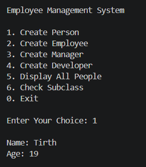

---

# 💼 Create Employee

Creates an employee with:

- Name
- Age
- ID
- Salary

### Concepts Used

- Constructor
- Destroctor
- Encapsulation
- Private Variables

### Output

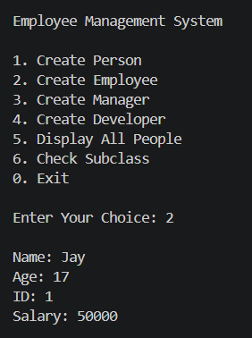

---

# 🧑‍💼 Create Manager

Creates a manager by inheriting Employee class.

Additional Field:

- Department

### Concepts Used

- Inheritance
- Method Overriding
- super()

### Output

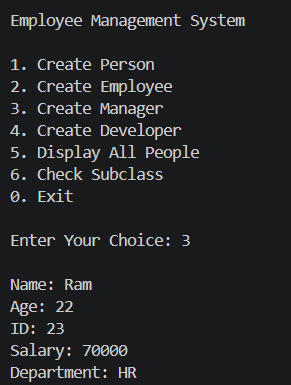

---

# 👨‍💻 Create Developer

Creates a developer by inheriting Employee class.

Additional Field:

- Programming Language

### Concepts Used

- Inheritance
- Method Overriding
- super()

### Output

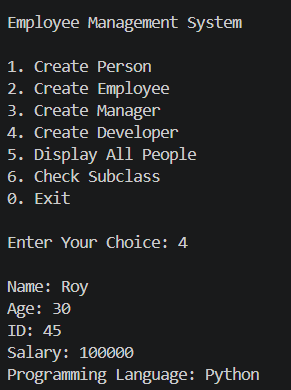

---

# 📄 Display All Records

Displays all stored objects category-wise.

Includes:

- Person Records
- Employee Records
- Manager Records
- Developer Records

### Output

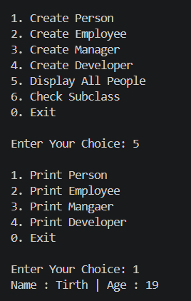
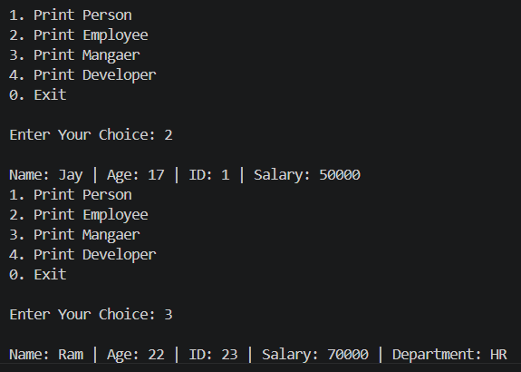
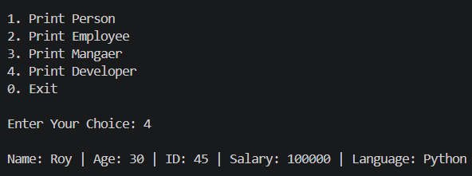

---

# 🔍 Check Subclass

Uses `issubclass()` to check inheritance.

### Output

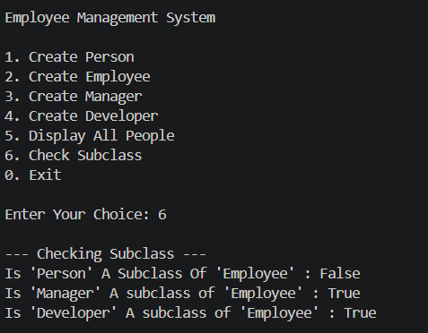

---
# Destructor

A destructor is a special member function that is automatically called when an object goes out of scope or is explicitly deleted to deallocate memory and clean up resources used by that object.

### Output

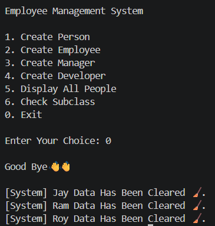

---
# 🚫 Error Handling

The program handles invalid menu choices and submenu choices.

### Output

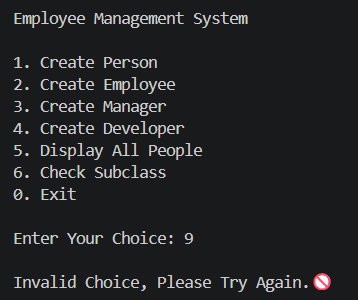
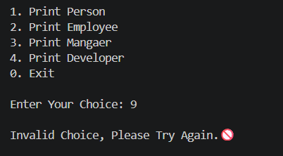

---

# 🛠️ Tech Stack

| Technology | Purpose |
|------------|---------|
| 🐍 Python | Core Programming Language |
| 🏗️ Class | Blueprint for objects |
| 📦 Object | Stores object data |
| ⚙️ Constructor | Initialize objects |
| 🧹 Destructor | Clear object data |
| 🧬 Inheritance | Parent-child relationship |
| 🔄 Method Overriding | Redefine parent methods |
| 🔄 Method Overloading | Multiple Method |
| 🔒 Encapsulation | Protect private variables |
| 📚 Lists | Store multiple objects |
| 🔍 issubclass() | Check inheritance |
| 🔁 Loops | Menu repetition |
| 🎛️ Match Case | Menu option handling |
| 🖥️ Console I/O | User interaction |

---

# 📈 Results & Insights

After executing the program:

- ✅ Multiple records can be created dynamically
- ✅ Inheritance works correctly
- ✅ Encapsulation protects sensitive data
- ✅ Method overriding customizes behavior
- ✅ Method overloading multiple way of creating
- ✅ Destructor clears data when object is removed
- ✅ Subclass relationships are verified

---

# 🏆 Advantages

| Advantage | Description |
|-----------|-------------|
| 🎓 Beginner Friendly | Easy OOP project |
| 📚 Educational | Covers important OOP concepts |
| ⚡ Fast | Efficient object management |
| 🧠 Practical | Real-world employee system |
| 🔄 Extendable | Easy to add more roles |
| 🖥️ Lightweight | Runs in terminal |

---

# 👤 Author
<div align="center">

**Tirth Donga**

[](https://github.com/tirthdonga)

🎓 Python Programming Project
</div>

---

### ⭐ Thank You For Visiting This Project ⭐

Made with ❤️ using Python
