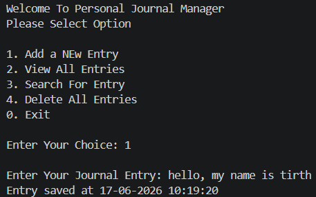
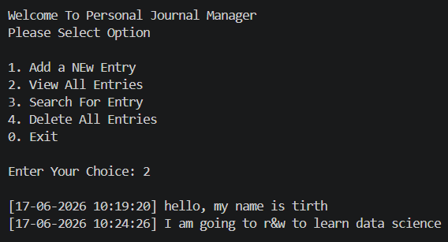
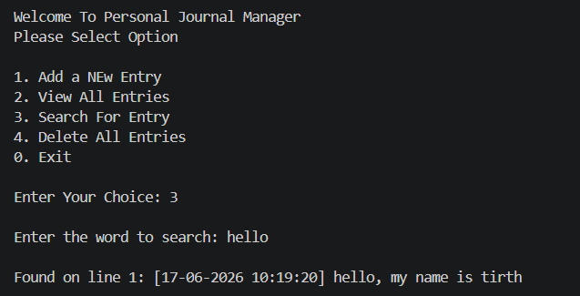
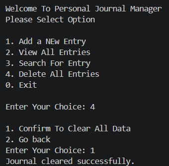
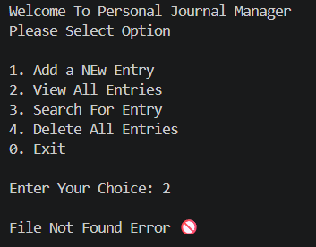
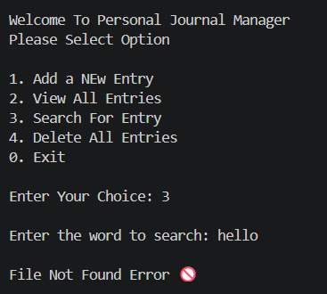

# 📔 Personal Journal Manager

### *Interactive Python Console Application for Writing, Viewing, Searching, and Managing Personal Journal Entries*

---

# 📋 Table of Contents

- [📌 Overview](#-overview)
- [🎯 Problem Statement](#-problem-statement)
- [✨ Key Features](#-key-features)
- [🏗️ Project Structure](#-project-structure)
- [🔄 Project Workflow](#-project-workflow)
- 1 -[📝 Add New Entry](#-add-new-entry)
- 2 -[📖 View All Entries](#-view-all-entries)
- 3 -[🔍 Search Journal Entry](#-search-journal-entry)
- 4 -[🗑️ Delete All Entries](#-delete-all-entries)
- [🚫 Error Handling](#-error-handling)
- [🛠️ Tech Stack](#-tech-stack)
- [📈 Results & Insights](#-results--insights)
- [🏆 Advantages](#-advantages)

---

# 📌 Overview

The **Personal Journal Manager** is a menu-driven Python application used for managing personal journal entries with file handling.

It includes:
- File Handling
- OOP Concepts
- Exception Handling
- Date & Time Handling
- Search Operations

---

# 🎯 Problem Statement

Build a Python console application that allows users to:
- Add journal entries
- View saved entries
- Search entries
- Clear journal file

---

# ✨ Key Features

| Feature | Description |
|---------|-------------|
| 📝 Add Entry | Save journal with timestamp |
| 📖 View Entries | View all stored entries |
| 🔍 Search Entry | Search words in journal |
| 🗑️ Delete Entries | Clear all data |
| ⏰ Timestamp | Saves current time automatically |
| ⚠️ Error Handling | Prevents crashes |

---

# 🏗️ Project Structure

```text
📦 Project 6/
│
├── 📄 journal_manager.py
├── 📄 journal.txt
└── 📄 README.md
```

---

# 🔄 Project Workflow

```text
Program Start
      │
      ▼
Display Main Menu
      │
      ├── 1 ➜ Add New Entry
      ├── 2 ➜ View All Entries
      ├── 3 ➜ Search Entry
      ├── 4 ➜ Delete All Entries
      └── 0 ➜ Exit
```

---

# 📝 Add New Entry

Adds a new journal entry with current date and time.

Concepts:
- datetime
- file append mode

### Output



---

# 📖 View All Entries

Reads and displays all journal content.

Concepts:
- file read mode
- exception handling

### Output



---

# 🔍 Search Journal Entry

Searches for a specific word and shows matching line.

Concepts:
- loops
- string search
- file iteration

### Output



---

# 🗑️ Delete All Entries

Clears all entries after confirmation.

Concepts:
- file write mode
- conditions

### Output



---

# 🚫 Error Handling

Handles:
- FileNotFoundError
- ValueError
- Invalid menu choices

### Output




---

# 🛠️ Tech Stack

| Technology | Purpose |
|------------|---------|
| 🐍 Python | Core Language |
| 🏗️ Class | Journal blueprint |
| 📦 Object | Journal object |
| 📂 File Handling | Store journal entries |
| ⏰ Datetime | Save timestamps |
| 🚫 Exception Handling | Handle errors |
| 🔁 Loops | Repeat menu |
| 🎛️ Match Case | Menu options |

---

# 📈 Results & Insights

- ✅ Entries are saved with timestamps
- ✅ Entries can be searched easily
- ✅ Data can be cleared quickly
- ✅ File errors are handled properly

---

# 🏆 Advantages

| Advantage | Description |
|-----------|-------------|
| 🎓 Beginner Friendly | Easy to understand |
| 📚 Educational | Good file handling practice |
| ⚡ Fast | Quick save and search |
| 🧠 Practical | Useful personal journal app |

---

# 👤 Author

**Tirth Donga**

Python File Handling Project

---

### ⭐ Thank You For Visiting This Project ⭐

Made with ❤️ using Python
