<div align="center">

# 🔢 NumPy Analyzer
### *Interactive Python Console Application for NumPy Array Operations and Statistical Analysis*


</div>

---

# 📋 Table of Contents

- [📌 Overview](#-overview)
- [🎯 Problem Statement](#-problem-statement)
- [✨ Key Features](#-key-features)
- [🏗️ Project Structure](#-project-structure)
- [🔄 Project Workflow](#-project-workflow)
- [📦 Array Management](#-array-management)
- [✂️ Indexing & Slicing](#️-indexing--slicing)
- [➕ Mathematical Operations](#-mathematical-operations)
- [🔗 Combine & Split Arrays](#-combine--split-arrays)
- [🔍 Search, Sort & Filter](#-search-sort--filter)
- [📊 Aggregate & Statistics](#-aggregate--statistics)
- [🚫 Error Handling](#-error-handling)
- [🛠️ Tech Stack](#️-tech-stack)
- [📈 Results & Insights](#-results--insights)
- [🏆 Advantages](#-advantages)
- [👤 Author](#-author)
---

# 📌 Overview

**NumPy Analyzer** is a menu-driven Python application developed using **NumPy** and **Object-Oriented Programming (OOP)**. It allows users to create arrays, perform mathematical operations, manipulate data, and calculate statistical values through an interactive console interface.

---

# 🎯 Problem Statement

Build a console-based application that demonstrates NumPy array operations while applying OOP principles such as encapsulation, constructors, static methods, and reusable class methods.

---

# ✨ Key Features

| Feature | Description |
|---------|-------------|
| 🔢 Array Creation | Create 1D, 2D & 3D arrays |
| ✂️ Indexing & Slicing | Access and slice arrays |
| ➕ Math Operations | Add, subtract, multiply, divide |
| 🧮 Matrix Operations | Dot product & matrix multiplication |
| 🔗 Combine & Split | Stack and split arrays |
| 🔍 Search & Sort | Search, sort ascending/descending |
| 🎯 Filter | Filter values using conditions |
| 📊 Statistics | Sum, Mean, Median, Std, Variance |
| 🛡️ Error Handling | Handles invalid inputs safely |

---

# 🏗️ Project Structure

```text
📦 Project 8/
│── 📂 images
│── 📄 numpy_analy.py
└── 📄 README.md
```

---

# 🔄 Project Workflow

```text
Start
  │
  ▼
Welcome Screen
  │
  ├── Create Array
  ├── Indexing & Slicing
  ├── Mathematical Operations
  ├── Combine / Split Arrays
  ├── Search / Sort / Filter
  ├── Statistics
  └── Exit
```

---

# 📦 Array Management

- Create 1D Arrays
- Create 2D Arrays
- Create 3D Arrays

### Output

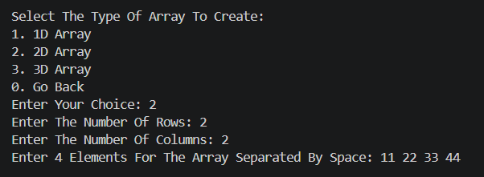

---

# ✂️ Indexing & Slicing

- Element Indexing
- Row & Column Slicing
- Shape Display

### Output

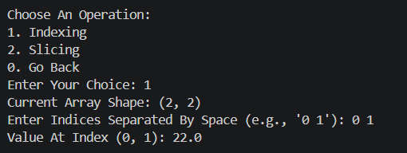
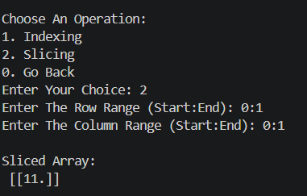

---

# ➕ Mathematical Operations

- Addition
- Subtraction
- Multiplication
- Division
- Matrix Multiplication
- Dot Product

### Output

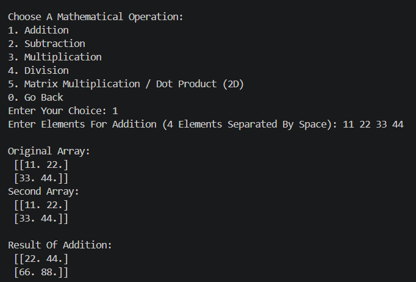
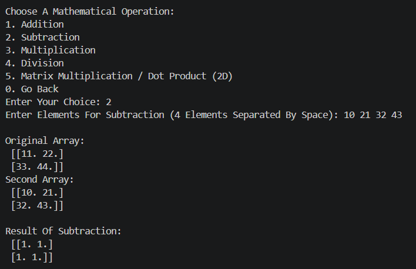
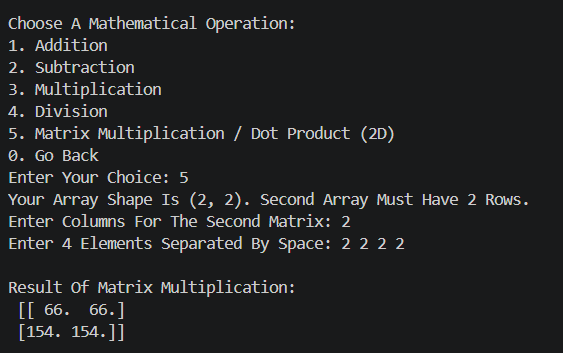

---

# 🔗 Combine & Split Arrays

- Vertical Stack (`np.vstack`)
- Split Arrays (`np.array_split`)

### Output

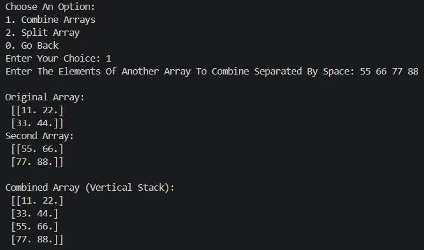
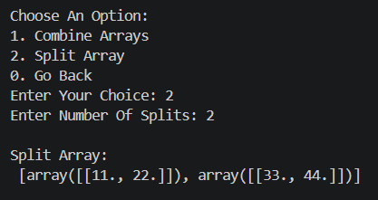

---

# 🔍 Search, Sort & Filter

- Search using `np.where()`
- Ascending & Descending Sort
- Filter values greater than user input

### Output

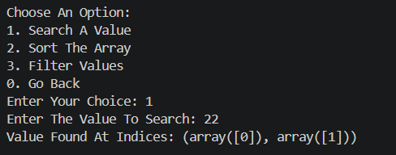
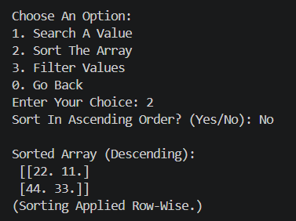
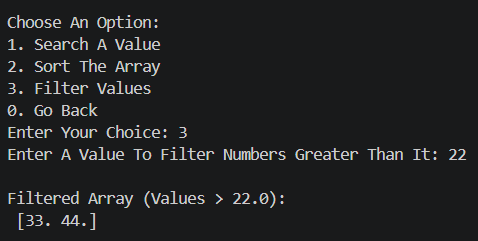

---

# 📊 Aggregate & Statistics

- Sum
- Mean
- Median
- Standard Deviation
- Variance

### Output

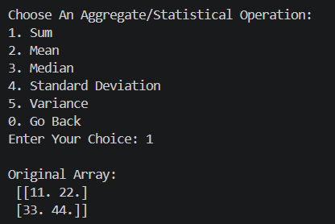
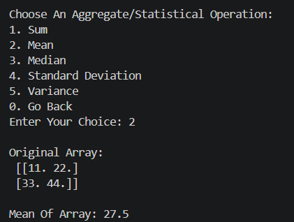
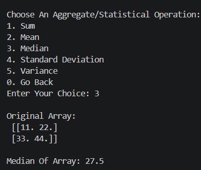
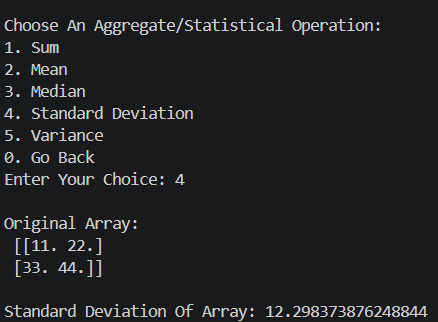
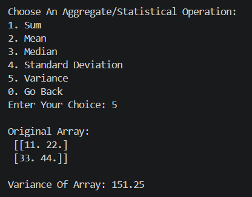

---

# 🚫 Error Handling

- Invalid menu selection
- Invalid numeric input
- Shape mismatch
- Invalid indexing
- Invalid reshape dimensions

### Output

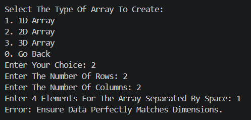
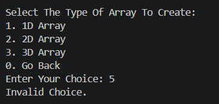
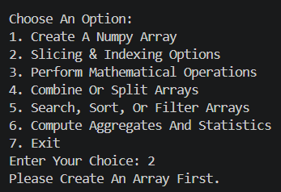
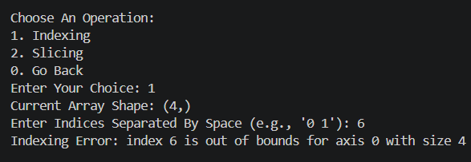
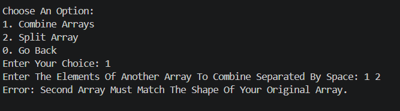

---

# 🛠️ Tech Stack

| Technology | Purpose |
|-----------|---------|
| 🐍 Python | Programming Language |
| 🔢 NumPy | Numerical Computing |
| 🧱 OOP | Program Structure |
| 🎛️ Match Case | Menu Control |
| ⚠️ Exception Handling | Error Management |
| 🖥️ Console | User Interface |

---

# 📈 Results & Insights

- ✅ Efficient NumPy array manipulation
- ✅ Clean OOP-based implementation
- ✅ Interactive menu-driven interface
- ✅ Robust input validation
- ✅ Practical statistical analysis

---

# 🏆 Advantages

| Advantage | Description |
|----------|-------------|
| 🎓 Educational | Covers NumPy and OOP together |
| ⚡ Fast | NumPy-based computations |
| 📚 Beginner Friendly | Easy-to-understand menus |
| 🔄 Modular | Easily extendable |
| 💻 Lightweight | Runs in terminal |

---

# 👤 Author

<div align="center">

**Tirth Donga**

🎓 Python NumPy Analyzer Project


---

### ⭐ Thank You For Visiting This Project ⭐

Made with ❤️ using Python & NumPy

</div>