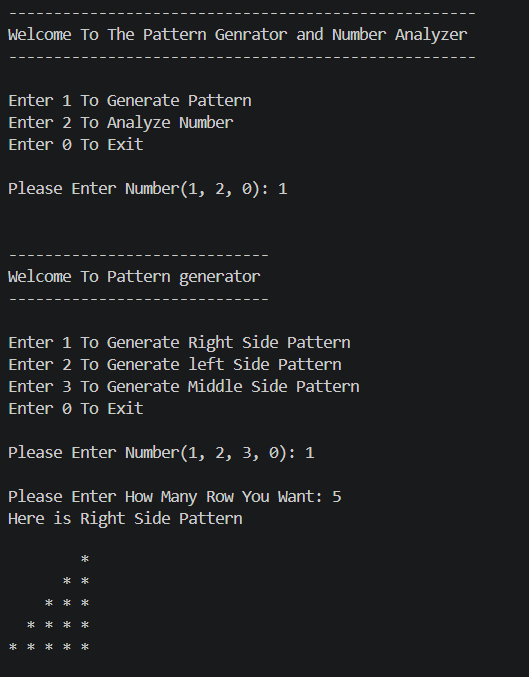
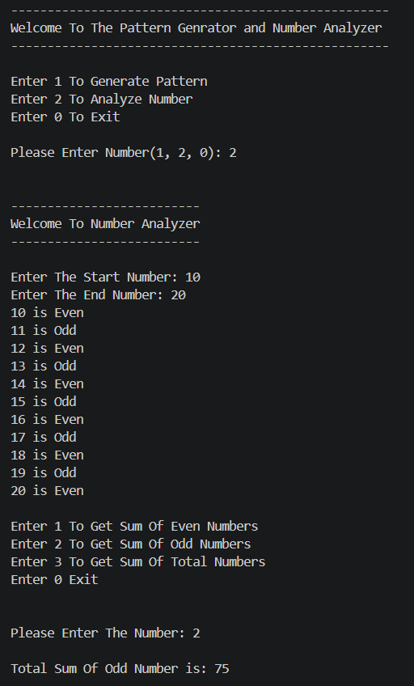
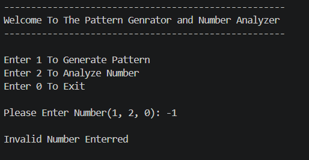
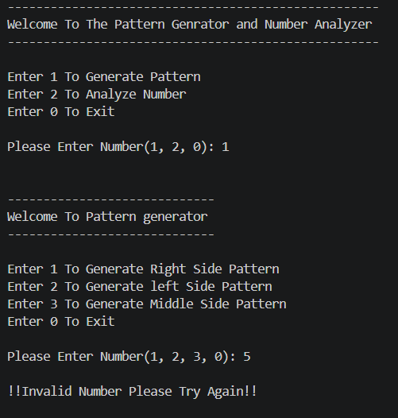

<div align="center">

# <span style="color:#4A90E2;">🚀 Logic Box</span>

### <span style="color:#7F8C8D;">Pattern Generator & Number Analyzer using Python</span>

</div>

---

## <span style="color:#3498DB;">📖 Overview</span>

Logic Box is a Python console-based application that combines multiple utilities into one menu-driven program. This project allows users to generate different star patterns and analyze numbers within a selected range.

The project is beginner-friendly and demonstrates the practical use of loops, conditional statements, match-case statements, and user input handling in Python.

---

## <span style="color:#3498DB;">✨ Features</span>

### 🔹 Pattern Generator

Generate different star (`*`) patterns:

- Right Side Pattern
- Left Side Pattern
- Middle Side Pattern

Users can select the number of rows and instantly generate their chosen pattern.

---

### 🔹 Number Analyzer

Analyze numbers within a selected range:

- Identify Even Numbers
- Identify Odd Numbers
- Calculate Sum of Even Numbers
- Calculate Sum of Odd Numbers
- Calculate Total Sum of Numbers

---

## <span style="color:#3498DB;">🛠 Technologies Used</span>

- Python
- While Loop
- For Loop
- Match Case
- Conditional Statements
- User Input Handling

---

## <span style="color:#3498DB;">⚙ Requirements</span>

Before running the project, ensure you have:

- Python 3.x installed
- Code editor (VS Code / PyCharm / IDLE)

---

## <span style="color:#3498DB;">▶️ How To Run</span>

1. Download the project files

2. Open terminal or command prompt

3. Navigate to project folder

4. Run:

```bash
python Logic_box.py
```

---

## <span style="color:#3498DB;">📊 Project Flow</span>

```text
Start Program
      ↓
 Main Menu
      ↓
Pattern Generator / Number Analyzer
      ↓
Process User Input
      ↓
Display Results
```

---

## <span style="color:#3498DB;">🖼 Application Preview (Output)</span>

### 🔹 Pattern Generator

<p align="center">
  
</p>

---

### 🔹 Number Analyzer

<p align="center">
  
</p>

---

### 🔹 Error Handling

<p align="center">
  
---
  
</p>


---


## <span style="color:#3498DB;">📁 Project Structure</span>

```text
project 2/
│
├── Logic_box.py
├── README.md
└── image/
      ├── pattern.png
      ├── number.png
      ├── error.png
      └── error2.png
```

---

<div align="center">

### ⭐ Thank You


</div>